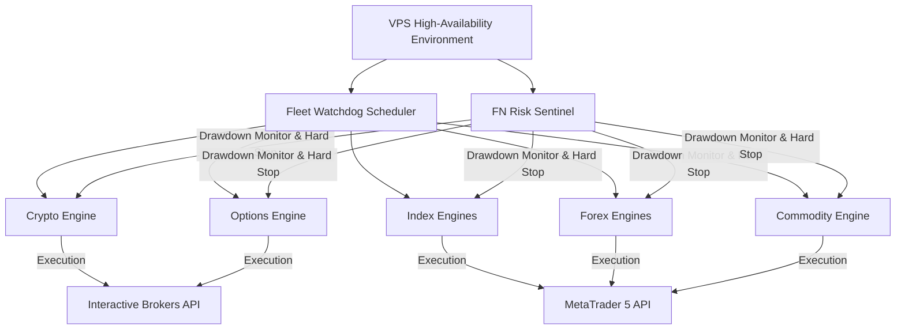

# 📑 AI Quantitative Trading Fleet (Live VPS Portfolio)

> A stateful, highly diversified multi-model algorithmic trading portfolio running 24/7 on a secure VPS.

This repository serves as the public architectural showcase and documentation for the **AI Quantitative Trading Fleet**. The fleet consists of **8 specialized trading engines** executing strategies across Cryptocurrencies, Stock Indices, Forex, Commodities, and Stock Options. 

All execution processes are controlled by a centralized **Watchdog Scheduler** and an automated **Risk Sentinel** to guarantee high availability, strict drawdown enforcement, and zero-latency execution.

---

## 🛠️ Fleet Architecture Overview

---

## 📊 Fleet Component Matrix

| Bot / Engine Name | Asset Class / Target | Core Strategy / Regime | Backtest ROI | Max Drawdown | Execution Interface |
| :--- | :--- | :--- | :---: | :---: | :--- |
| **1. BTCUSD 24/7 Super Bot** | Cryptocurrencies | Machine Learning (XGBoost) Dual-Regime (ADX/RSI) | **+17.86%** | 5.29% | MT5 API |
| **2. NASDAQ Super Bot v5.0** | Indices (NAS100) | Ensemble ML (XGBoost + LightGBM) Inter-market | **+65.79%** | 6.17% | MT5 API (FTMO Guard) |
| **3. US30 Session Breakout** | Indices (US30) | NY Open Institutional Volume Breakout (XGBoost) | **+22.70%** | 4.67% | MT5 API |
| **4. EURO Super Bot v5.0** | Forex (EUR) | VWAP Standard Deviation Range Mean Reversion | **+1.97%** | **0.98%** | MT5 API |
| **5. EURUSD Swing Architect** | Forex (EURUSD) | Multi-Timeframe (H1/H4) Structural Swing | **+11.20%** | 3.45% | MT5 API (Breakeven SL) |
| **6. GOLD Breakout Sniper** | Commodities (XAUUSD) | M15 Volatility Breakout (Z-Score Vol/ATR) | **+34.51%** | 5.12% | MT5 API |
| **7. Pepperstone Accelerator 500** | Micro Indices | Order Book Imbalance Scalper (Micro Accounts) | **+25.70%** | 8.20% | MT5 API (0.01 lot caps) |
| **8. IBKR Options Bot** | US Equities | Bull Put Credit Spreads (VIX-Adaptive Delta) | **+14.2% (Ann.)** | 11.5% | IBKR API |

---

## 🤖 Strategy & Deep-Dive Specifications

### 1. BTCUSD 24/7 Super Bot (`C:\BTC_SUPER_BOT`)
* **Logic:** Employs an XGBoost Classifier trained on historical Bitcoin volatility. It dynamically switches between two market regimes:
  * **Trend-Following (ADX > 25):** Aligns trades with the 15-minute Exponential Moving Average (EMA 50).
  * **Mean Reversion (ADX < 25):** Enters buy/sell trades on extreme RSI conditions (RSI < 35 for buy, RSI > 65 for sell).
* **Risk Parameters:** Stop Loss at 1.5x ATR, Take Profit at 2.5x ATR (1:2.5 Risk/Reward). Maximum of 2 concurrent positions.

### 2. NASDAQ Super Bot v5.0 (`C:\NASDAQ_SUPER_BOT_V5`)
* **Logic:** An ensemble of XGBoost and LightGBM models trained on M5 order flow. It detects inter-market spread divergence between NASDAQ (US100) and S&P500 (US500) to capture explosive micro-trends.
* **Risk Parameters:** Features **FTMO Guard v5.0** which enforces an immediate, hard shutdown of all trading processes if the daily account loss reaches 4.5% or total drawdown hits 8.0%.
* **Filters:** Automated news blackout (halts trading 30m before and 15m after high-impact macro news) and daily rollover freeze (23:50 to 00:10).

### 3. US30 Session Breakout (`C:\US30_SUPER_BOT`)
* **Logic:** Specializes in institutional breakout moves during the New York market open. Features an XGBoost Classifier optimized for the initial 2 hours of NY volatility.
* **Filters:** Strict temporal filter (active execution only between 14:30 and 21:00 UTC). Stop Loss at 1.5x ATR and Take Profit at 2.5x ATR.

### 4. EURO Super Bot v5.0 (`C:\EURO_SUPER_BOT_V5`)
* **Logic:** Ultra-low risk Mean Reversion bot tracking volume-weighted average price (VWAP) deviations.
* **Risk Parameters:** Designed for maximum capital preservation (backtested maximum drawdown is under 1.00% overall). Employs dynamic trailing stops.

### 5. EURUSD Swing Architect (`C:\EURUSD_SWING_ARCHITECT`)
* **Logic:** A classic H1/H4 swing trading engine executing on M15. Identifies key support/resistance zones and enters on price action confirmations.
* **Risk Parameters:** Strict 1.0% risk per trade. Includes an automated break-even script that moves the Stop Loss to the entry price once a 1:1 Risk/Reward ratio is achieved.

### 6. GOLD Breakout Sniper (`C:\GOLD_BREAKOUT_SNIPER`)
* **Logic:** Volatility Breakout scanner using Z-score volume deviations and ATR bands expansion. Enters on strong, high-volume momentum breaks.
* **Filters:** Trading is completely blocked during the Asian session due to wider broker spreads and lower liquidity.

### 7. Pepperstone Accelerator 500 (`C:\PEPPERSTONE_ACCELERATOR_500`)
* **Logic:** Micro-lot scalper optimized for small retail accounts. Exploits minor order book imbalances on micro-futures indices.
* **Risk Parameters:** Strict lot-size ceiling (0.01 - 0.02 lots) to prevent margin calls on small balances.

### 8. IBKR Options Bot (`C:\ib_options_bot`)
* **Logic:** Automated credit spread engine selling Bull Put Spreads (selling 0.15 Delta Put, buying protective Put 5 strikes below) with 30-45 Days to Expiration (DTE).
* **VIX-Adaptive Delta:** Dynamically increases strike safety margins during high volatility regimes (high VIX).
* **Gamma Risk Shield:** Closes out all open options positions once they reach 21 DTE to completely avoid late-stage Gamma risk.
* **Earnings Blackout:** Restricts entry on stocks with earnings reports occurring within 14 days of options expiration.

---

## 🛡️ Centralized Safeguards & Operations

### 1. Central Watchdog Scheduler (`FleetWatchdog`)
Registered directly in the Windows Task Scheduler (PID `7388`) outside the development sandbox. If any trading script terminates due to broker API disconnects or memory cleans, the Watchdog restarts the execution process within 5 seconds.

### 2. Live Risk Sentinel (`FN Risk Sentinel`)
An independent Python process (PID `6320`) running alongside the trading terminals. It monitors aggregate equity across all active accounts. If any anomalies (e.g. broker API errors, connection drops, or unforeseen market gap downs) push the global drawdown past a pre-configured threshold, the Risk Sentinel executes a hard market close of all open trades and locks all APIs.

---

## ⚖️ Disclaimer
*These systems are designed for proprietary trading, quant research, and personal wealth management. Past performance does not guarantee future results. Algorithmic trading involves significant risk of capital loss.*
