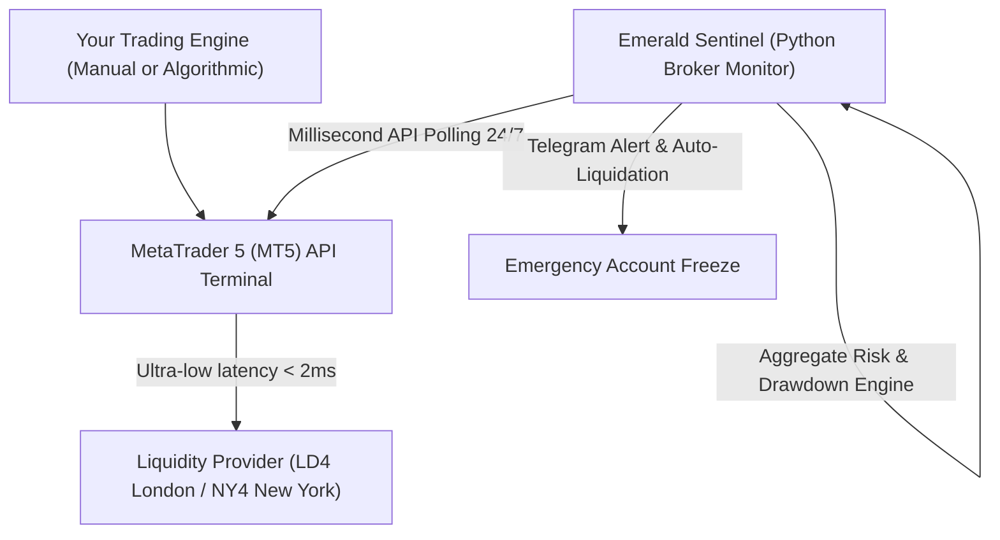

# 👑 FinTech & Algorithmic Risk Control: How VPS Automation and API Integration Protect Capital and Eliminate Human Execution Errors in Trading

**By Vasile Bratu**  
*Senior Python Engineer & FinTech Automation Specialist*

---

In the hyper-accelerated world of modern financial trading and Prop Trading accounts (such as FTMO, FundedNext, or futures evaluation accounts), the difference between consistent profitability and complete capital liquidation is no longer determined solely by analytical skill. It hinges directly on **execution latency, technical infrastructure stability, and strict, unemotional real-time risk mitigation.**

Many traders and asset managers still run their quantitative algorithms or trading terminals on standard home computers connected to residential Wi-Fi, leaving risk management (such as stop-loss adjustments and daily drawdown thresholds) to manual supervision. This is a high-risk operational structure. A minor power outage, a 10-second internet drop during major macroeconomic releases, or a split-second emotional hesitation can erase months of hard-earned trading profits in seconds.

This article explores how automated cloud infrastructure (VPS) and smart programmatic risk sentinels eliminate execution delay and emotional bias, providing institutional-grade safeguards for retail and professional traders alike.

---

## 🎯 1. The Hook: The Technical Vulnerability of the Unprotected Trader

In financial markets, price updates occur in microseconds. For professional traders—particularly those operating within Prop Trading firms where breaching the Daily Drawdown limit by a single dollar leads to instant account liquidation—technical discipline is paramount.

Consider this frequent technical hazard:
*   You run an automated trading system on a local desktop. You hold an active gold (XAUUSD) position during a high-impact Federal Reserve interest rate announcement.
*   At **2:30 PM**, market volatility spikes. Your residential internet connection suffers packet loss, increasing your network latency to 300ms.
*   Your algorithm attempts to submit an emergency close order to limit losses, but due to high latency, the order is delayed, rejected, or executed with severe negative *slippage*. You breach the 5% daily loss limit imposed by the Prop firm.
*   **Your account is permanently locked. You lose access to a $100,000 funded account due to a standard residential network glitch.**

Had the trading terminal been hosted on an optimized financial VPS located within the same data center as your broker's execution engine, network latency would have remained under **2 milliseconds**, executing the close order flawlessly and preserving the account.

---

## 🛑 2. The Problem: The Cognitive Limits of Manual Risk Management

Human execution falls short in high-frequency trading environments for three reasons:
1.  **Physical Latency**: The average human reaction time is 200-250ms, plus the physical time required to click a mouse and transmit the packet over residential networks. During high volatility, price swings bypass human actions completely.
2.  **Emotional Slippage (Hope vs. Discipline)**: When a trade moves into negative territory, human psychology naturally hopes for a reversal. This cognitive bias often leads traders to move or completely remove stop-losses, violating their risk parameters. An automated, independent risk sentinel has no emotions; it executes safety protocols with mathematical precision.
3.  **Data Fragmentation**: Tracking net exposure across multiple instruments, calculating margin limits, and monitoring aggregate drawdown in real time quickly exceeds human cognitive bandwidth under stress.

---

## ⚡ 3. The Architecture: "Emerald Sentinel" – Latency-Zero Protective Pipelines

A robust institutional setup requires separating trading logic from **risk enforcement**. We deploy a specialized FinTech architecture named **"Emerald Sentinel"**:

1.  **Financial-Grade VPS hosting (Zero Latency)**: We deploy trading terminals (MetaTrader 4/5, cTrader) on highly optimized, dedicated cloud servers located directly in primary financial hubs, such as Equinix LD4 (London) or NY4 (New York). This cuts network round-trip times down to under **2ms**.
2.  **Python Risk Sentinel**: An independent, lightweight Python daemon runs in the background, polling the terminal via secure API connections. The sentinel monitors account balance, margin utilization, open positions, and real-time floating PnL.
3.  **Automated Hard Stop Protection**: The millisecond the account's aggregate equity approaches within 0.5% of the daily drawdown threshold, the Python sentinel bypasses human intervention. It instantly liquidates all active market orders, cancels pending limits, and locks the API connection for the rest of the trading day, preserving trading capital.

---

## 📊 4. The "Emerald Sentinel" Reporting Standard

For fund managers and professional proprietary traders, we deliver performance dashboards styled in the clean **"Emerald Sentinel"** aesthetic:

*   **Slate & Emerald Palette**: High-contrast, cool-toned gray layouts accented with vibrant emerald green indicators representing risk safety zones, and soft coral accents highlighting breached volatility thresholds.
*   **Drawdown Metrics & Equity Curve Tracking**: Interactive charts highlighting maximum daily drawdown, profit factors, win/loss ratios, and peak leverage utilization.
*   **Order Execution Latency Analysis**: Detailed network round-trip auditing, identifying broker execution speeds and slippage profiles to optimize routing paths.
*   **Secure API Integrations**: Encrypted webhook connections sending automated graphical performance reports directly to private Slack or Telegram channels.

---

## 🛡️ 5. Redundancy & Cybersecurity in FinTech Deployments

Designing robust financial execution pipelines requires structural redundancy:
*   **Fail-Safe Protocols**: The Risk Sentinel features automatic API reconnect sequences, dual-server monitoring, and cloud-hosted daemon fallbacks to guarantee 99.99% uptime.
*   **Cryptographic Key Isolation**: Broker API credentials, read-write tokens, and private server keys are isolated and encrypted, ensuring zero exposure to unauthorized third parties.

---

## 🚀 The Roadmap: Secure Your Trading Capital with Institutional Tech

In modern financial markets, engineering discipline outperforms market intuition. Do not leave your trading accounts, prop firm evaluations, or client capital exposed to residential internet failures or emotional execution delay. Risk automation is your ultimate defensive asset.

If you are ready to upgrade your trading infrastructure:

> [!TIP]
> **Defend your trading capital today:**
> I am ready to conduct a **free latency and infrastructure audit** of your current trading setup. I will analyze your network routing paths to your broker's server and provide a detailed report styled in the **"Emerald Sentinel"** format, along with a **demo version of the Python Daily Drawdown Protection script** for MetaTrader 5.

**Send me a quick message on WhatsApp or email to launch your free infrastructure audit!**
*   **Direct Message on WhatsApp:** [+39 320 948 1876](https://wa.me/393209481876)
*   **Professional Email:** [amendamax@vasiledev.com](mailto:amendamax@vasiledev.com)
*   **Open-Source Portfolio (GitHub):** [github.com/amendamax/python-b2b-lead-scrapers](https://github.com/amendamax/python-b2b-lead-scrapers)

---
*Developed by Vasile Bratu © 2026. High-Performance Software Engineering & Data Architecture.*
