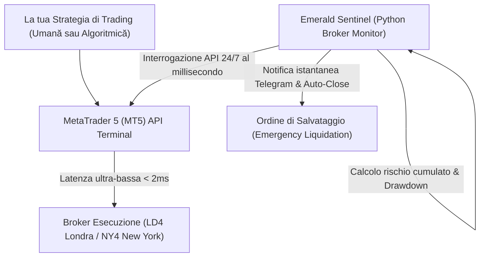

# 👑 FinTech e Controllo Algoritmico del Rischio: Come l'automatizzazione VPS e l'integrazione API proteggono il capitale ed eliminano gli errori umani nel trading

**Di Vasile Bratu**  
*Senior Python Engineer & FinTech Automation Specialist*

---

Nel mondo del trading finanziario moderno e dei conti di Prop Trading (come FTMO, MyForexFunds o valutazioni futures), la differenza tra una redditività costante e la perdita completa del capitale non è più dettata unicamente dalla qualità della strategia di analisi. Dipende in modo diretto dalla **velocità di esecuzione, dalla stabilità dell'infrastruttura tecnica e dal controllo rigoroso e privo di emozioni del rischio quotidiano.**

Molti trader e gestori di fondi in Italia eseguono ancora i propri algoritmi o piattaforme su computer personali collegati a reti Wi-Fi instabili, lasciando la gestione del rischio (Stop Loss, controllo della perdita massima giornaliera - Daily Drawdown) all'attenzione umana. Questa è la ricetta perfetta per un disastro. Una banale interruzione di corrente, una disconnessione internet di soli 10 secondi durante il rilascio di dati macroeconomici o un'esitazione emotiva di un istante possono azzerare settimane di profitti in pochi secondi.

Questo articolo analizza come l'automatizzazione dell'infrastruttura cloud (VPS) e i sistemi intelligenti di controllo del rischio (sotto forma di sentinella algoritmica) eliminino il fattore emotivo e gli errori di esecuzione, offrendo ai trader un vantaggio tecnico assoluto.

---

## 🎯 1. Il Gancio: Il disastro tecnico del trader indisciplinato o disconnesso

Nei mercati finanziari, il prezzo si muove in millisecondi. Per i trader professionisti e in particolare per chi affronta le rigorose valutazioni delle società di Prop Trading (dove superare il limite di Daily Drawdown anche di solo 1 € comporta la squalifica immediata del conto), la disciplina tecnica è una questione di sopravvivenza.

Immagina questo scenario:
*   Stai eseguendo una strategia automatizzata sul laptop di casa. Hai una posizione aperta sull'oro (XAUUSD) durante la conferenza stampa della Federal Reserve (FED).
*   Alle **15:30**, il mercato diventa estremamente volatile. La tua connessione di casa registra una latenza di 300ms, e il provider locale subisce una micro-interruzione.
*   Il tuo algoritmo tenta di inviare l'ordine di chiusura per limitare le perdite, ma a causa dell'alta latenza o della disconnessione, l'ordine viene rifiutato o eseguito con uno *slippage* enorme. Superi il limite giornaliero di perdita del 5% imposto dalla Prop House.
*   **Il tuo conto viene bloccato istantaneamente. Hai perso l'accesso a un capitale di 100.000 € per un banale problema di connessione.**

Se l'algoritmo fosse stato eseguito su un server VPS ottimizzato, situato nello stesso data center del tuo broker, la latenza di rete sarebbe stata inferiore a **2 millisecondi**, e la posizione si sarebbe chiusa perfettamente, salvando il tuo conto.

---

## 🛑 2. Il Problema: Perché la gestione manuale del rischio è un'illusione di fronte all'alta frequenza

I trader umani sono strutturalmente soggetti a errori per due ragioni fondamentali:
1.  **Lentezza fisica nell'esecuzione**: Il tempo di reazione umano medio è di circa 200-250ms, a cui si sommano la latenza di rete e il tempo fisico per cliccare sul mouse. In mercati volatili, il prezzo può percorrere decine di pip in quell'intervallo.
2.  **Speranza e Avidità (La Barriera Emotiva)**: Quando un'operazione va in perdita, la psicologia umana tende a sperare in un'inversione del mercato. Il trader spesso decide di spostare o rimuovere lo Stop Loss, violando il piano di trading. Una sentinella algoritmica indipendente non ha emozioni: esegue gli ordini con precisione millimetrica.
3.  **Frammentazione dei Dati**: Monitorare contemporaneamente l'esposizione su 5-6 coppie valutarie differenti, calcolare le correlazioni e verificare il rischio cumulativo in tempo reale supera le capacità cognitive di qualsiasi essere umano sotto stress.

---

## ⚡ 3. La Soluzione: L'architettura "Emerald Sentinel" – Sicurezza e Latenza Zero

La soluzione professionale consiste nel separare nettamente la logica di trading dalla logica di **controllo del rischio**. Per i nostri clienti, implementiamo un'architettura FinTech basata sul sistema **"Emerald Sentinel"**:

1.  **VPS FinTech Ottimizzato (Latenza Zero)**: Ospitiamo le piattaforme di trading (MetaTrader 4/5, cTrader) su server Windows/Linux dedicati e ottimizzati, posizionati strategicamente nei data center finanziari di Londra (LD4) o New York (NY4). Questo riduce la latenza a meno di **2ms**.
2.  **La Sentinella di Rischio in Python (Risk Sentinel)**: Uno script Python indipendente gira in background, connesso tramite API direttamente al terminale di trading. Lo script monitora costantemente il saldo del conto, il margine utilizzato, il profitto/perdita fluttuante (floating PnL) e l'esposizione cumulata.
3.  **Liquidazione di Emergenza Protetta (Hard Stop-Loss)**: Nel momento in cui il conto si avvicina allo 0.5% dal limite massimo di drawdown consentito, Python Risk Sentinel interviene istantaneamente: chiude tutte le posizioni attive, cancella gli ordini pendenti e blocca temporaneamente l'operatività per il resto della giornata, proteggendo il capitale da un crash completo.

---

## 📊 4. Lo Standard di Design "Emerald Sentinel": Reportistica per la Gestione di Portafoglio

Per gestori di fondi e trader privati, forniamo report di performance giornalieri e settimanali secondo lo standard visivo **"Emerald Sentinel"**:

*   **Tonalità Slate & Emerald**: Interfacce e tabelle pulite con sfondi grigio ardesia professionali, accenti verde smeraldo brillante per le operazioni conformi e accenti corallo tenue per le posizioni che hanno attivato i limiti di protezione.
*   **Statistiche di Drawdown Avanzate**: Curve di equity dinamiche, grafici del profit factor, win rate e, soprattutto, l'esposizione massima al rischio registrata durante le sessioni operative.
*   **Analisi della Latenza**: Statistiche dettagliate sulla velocità di esecuzione degli ordini da parte del broker, evidenziando gli episodi di *slippage* negativo e suggerendo ottimizzazioni di instradamento.
*   **Allerte e Cloud Sync**: Integrazione diretta con database protetti e invio automatico di report grafici pronti all'uso via Telegram.

---

## 🛡️ 5. Stabilità e Ridondanza in Ambienti FinTech

La progettazione di infrastrutture finanziarie richiede il massimo livello di affidabilità:
*   **Protocolli Fail-Safe**: Python Risk Sentinel dispone di logiche di riconnessione automatica in caso di caduta della connessione API e monitoraggio incrociato tramite server di controllo secondari.
*   **Sicurezza delle Chiavi API**: Tutte le credenziali operative e le chiavi API dei broker vengono archiviate in forma cifrata, rispettando gli standard di cybersecurity più rigidi per impedire accessi non autorizzati.

---

## 🚀 Concluzione: Metti al sicuro la tua attività finanziaria con tecnologie d'élite

Sui mercati finanziari moderni, la disciplina tecnologica vince sempre sull'intuito. Non lasciare i tuoi conti Prop Trading o il capitale dei tuoi investitori in balia di disconnessioni di rete o stress emotivi. L'automazione algoritmica del rischio è la polizza assicurativa indispensabile per operare con successo a lungo termine.

Se desideri elevare gli standard di stabilità e sicurezza della tua infrastruttura di trading:

> [!TIP]
> **Proteggi il tuo capitale a partire da oggi:**
> Sono pronto a realizzare un **audit tecnico gratuito della tua latenza e della tua infrastruttura attuale**. Analizzerò i percorsi di connessione verso il tuo broker e ti fornirò un report completo in formato **"Emerald Sentinel"**, insieme a una **versione dimostrativa dello script di protezione contro il superamento del Daily Drawdown** per MetaTrader 5.

**Inviami un messaggio rapido su WhatsApp o e-mail per iniziare il tuo audit gratuito!**
*   **Messaggio diretto WhatsApp:** [+39 320 948 1876](https://wa.me/393209481876)
*   **E-mail:** [amendamax@vasiledev.com](mailto:amendamax@vasiledev.com)
*   **Portfolio Codice Sorgente (GitHub):** [github.com/amendamax/python-b2b-lead-scrapers](https://github.com/amendamax/python-b2b-lead-scrapers)

---
*Developed by Vasile Bratu © 2026. High-Performance Software Engineering & Data Architecture.*
