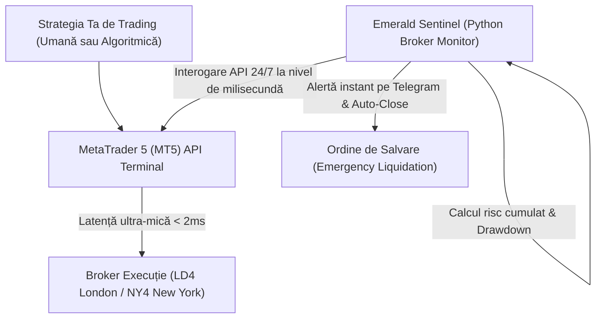

# 👑 FinTech și Controlul Algoritmic al Riscului: Cum automatizarea VPS și integrarea API protejează capitalul și elimină erorile umane în tranzacționare

**De Vasile Bratu**  
*Senior Python Engineer & FinTech Automation Specialist*

---

În lumea tranzacționării financiare moderne și a conturilor de tip Prop Trading (cum ar fi FTMO, MyForexFunds sau evaluările de tip futures), diferența dintre profitabilitatea constantă și pierderea completă a capitalului nu mai este dictată doar de calitatea strategiei de analiză. Ea depinde în mod direct de **viteza de execuție, stabilitatea infrastructurii tehnice și controlul strict, fără emoții, al riscului zilnic.**

Mulți traderi sau manageri de fonduri din România încă își rulează algoritmii sau platformele pe computere personale conectate la rețele Wi-Fi instabile, lăsând managementul riscului (Stop Loss, controlul pragului maxim de pierdere zilnică - Daily Drawdown) în seama atenției umane. Aceasta este o rețetă sigură pentru dezastru. O simplă pană de curent, o deconectare la internet de 10 secunde în timpul unei știri economice sau o ezitare emoțională de moment pot șterge săptămâni întregi de profit în câteva secunde.

Acest articol analizează modul în care automatizarea infrastructurii cloud (VPS) și sistemele inteligente de control al riscului (de tip sentinelă algoritmică) elimină factorul emoțional și erorile de execuție, oferind traderilor un avantaj tehnic absolut.

---

## 🎯 1. Cârligul: Coșmarul tehnic al traderului indisciplinat sau deconectat

În piețele financiare, prețul se mișcă în milisecunde. Pentru traderii profesioniști și în special pentru cei care trec prin procese riguroase de evaluare Prop Trading (unde încălcarea limitei de Daily Drawdown cu doar 1 USD duce la pierderea instantanee a contului), disciplina tehnică este vitală.

Imaginează-ți următoarea situație:
*   Rulezi o strategie automată pe laptopul tău de acasă. Ai o poziție deschisă pe aur (XAUUSD) în timpul unei decizii a Băncii Centrale Americane (FED).
*   La ora **15:30**, piața devine extrem de volatilă. Conexiunea ta de acasă are o latență de 300ms, iar furnizorul de internet local are o mică fluctuație.
*   Algoritmul tău încearcă să trimită comanda de închidere a poziției pentru a limita pierderile, dar din cauza latenței mari sau a deconectării, comanda este respinsă sau executată cu un *slippage* uriaș. Depășești limita zilnică de pierdere de 5% impusă de firma de Prop Trading.
*   **Contul tău este blocat instantaneu. Ai pierdut accesul la un capital de 100.000 USD din cauza unei probleme tehnice banale.**

Dacă algoritmul ar fi rulat pe un server VPS optimizat, situat în același centru de date cu serverul brokerului tău, latența ar fi fost sub **2 milisecunde**, iar poziția s-ar fi închis perfect, securizându-ți contul.

---

## 🛑 2. Problema: De ce managementul manual al riscului este o iluzie în fața algoritmilor de înaltă frecvență

Traderii umani sunt supuși erorilor din două motive fundamentale:
1.  **Lentoarea fizică a execuției**: Timpul de reacție al unui om este de aproximativ 200-250ms, la care se adaugă latența rețelei și timpul necesar pentru a da click pe ecran. Într-o piață volatilă, în acest interval prețul poate parcurge zeci de puncte.
2.  **Speranța și Lăcomia (Bariera Emoțională)**: Când o tranzacție merge în direcția greșită, psihologia umană tinde să spere că piața își va reveni. Traderul decide adesea să mute sau să elimine Stop Loss-ul, încălcând planul de trading. O santinelă algoritmică independentă nu are emoții; ea execută ordinele cu precizie matematică.
3.  **Fragmentarea Datelor**: Monitorizarea simultană a expunerilor pe 5-6 perechi valutare diferite, calcularea corelațiilor și verificarea riscului cumulat în timp real depășesc capacitatea cognitivă a unui om aflat sub stres.

---

## ⚡ 3. Soluția: Arhitectura "Emerald Sentinel" – Securizare și Latență Zero

Soluția profesională constă în separarea completă a logicii de trading de logica de **control al riscului**. Pentru clienții noștri, implementăm o arhitectură FinTech bazată pe sistemul **"Emerald Sentinel"**:

1.  **VPS FinTech Optimizat (Latență Zero)**: Găzduim platformele de tranzacționare (MetaTrader 4/5, cTrader) pe servere Windows Server/Linux special configurate, amplasate strategic în centrele de date financiare din Londra (LD4) sau New York (NY4). Acest lucru reduce latența de rețea la un nivel uluitor de sub **2ms**.
2.  **Santinela de Risc în Python (Risk Sentinel)**: Un script Python independent rulează în fundal, conectat prin API direct la terminalul de tranzacționare. Acest script monitorizează în permanență balanța contului, marja utilizată, profitul/pierderea curentă nerealizată (floating PnL) și riscul cumulat pe toate pozițiile active.
3.  **Lichidare de Urgență Securizată (Hard Stop-Loss)**: În momentul în care contul se apropie la 0.5% de limita maximă admisă de pierdere (drawdown), Python Risk Sentinel intervine instantaneu: închide toate pozițiile deschise, anulează ordinele în așteptare (pending orders) și blochează temporar posibilitatea de a deschide noi tranzacții în acea zi, protejând capitalul de o distrugere completă.

---

## 📊 4. Standardul de Design "Emerald Sentinel": Rapoarte Clare pentru Managementul Portofoliului

Pentru managerii de fonduri și traderii privați, livrăm rapoarte de performanță zilnice și săptămânale în formatul exclusiv **"Emerald Sentinel"**:

*   **Paletă Cromatică Slate & Emerald**: Fundaluri curate, în culori reci, profesionale (slate-gray), cu accente vibrante de verde smarald pentru tranzacțiile conforme și riscurile acoperite, și accente soft de coral pentru tranzacțiile care au atins limitele de siguranță.
*   **Statistici Avansate de Drawdown**: Diagrame și tabele dinamice care arată variația maximă a contului (Equity Curve), factorul de profit (Profit Factor), rata de câștig (Win Rate) și, cel mai important, expunerea maximă la risc înregistrată în timpul zilei.
*   **Analiza Latenței și Execuției**: Statistici clare despre viteza de execuție a ordinelor de către broker, evidențiind momentele în care s-a înregistrat *slippage* negativ și recomandări pentru optimizarea rutelor de conectare.
*   **Alerte și Sincronizare Cloud**: Integrare cu baze de date securizate și trimiterea automată a rapoartelor către Google Drive sau direct pe Telegram sub formă de imagini grafice clare.

---

## 🛡️ 5. Stabilitate și Siguranță în Medii de Înaltă Frecvență

Proiectarea sistemelor financiare cere redundanță absolută:
*   **Sisteme Fail-Safe**: Python Risk Sentinel include protocoale de reconectare automată în caz de pierdere a conexiunii API și monitorizare dublă prin servere secundare independente.
*   **Securitatea Cheilor API**: Toate credențialele de tranzacționare și cheile API sunt stocate securizat, criptat, respectând cele mai înalte standarde de securitate cibernetică, fără a expune vreodată conturile la acces neautorizat.

---

## 🚀 Concluzie: Securizează-ți succesul financiar prin tehnologie de elită

În piețele moderne, disciplina tehnică bate întotdeauna intuiția. Nu lăsa conturile tale de evaluare Prop Trading sau capitalul investitorilor tăi la mila deconectărilor la internet sau a fluctuațiilor emoționale. Automatizarea riscului este asigurarea de care ai nevoie pentru a tranzacționa cu succes pe termen lung.

Dacă vrei să aduci un plus de stabilitate și siguranță activității tale de trading:

> [!TIP]
> **Protejează-ți capitalul chiar de astăzi:**
> Sunt pregătit să configurez un **audit tehnic gratuit al latenței și infrastructurii tale actuale**. Voi analiza rutele tale de conectare către brokerul tău actual și îți voi livra un raport detaliat în formatul **"Emerald Sentinel"**, împreună cu o **versiune demo a scriptului de protecție împotriva depășirii limitei de Daily Drawdown** pentru MetaTrader 5.

**Trimite-mi un mesaj rapid pe WhatsApp sau e-mail pentru a începe auditul tău gratuit!**
*   **Mesaj direct pe WhatsApp:** [+39 320 948 1876](https://wa.me/393209481876)
*   **E-mail:** [amendamax@vasiledev.com](mailto:amendamax@vasiledev.com)
*   **Portofoliu Cod Sursă (GitHub):** [github.com/amendamax/python-b2b-lead-scrapers](https://github.com/amendamax/python-b2b-lead-scrapers)

---
*Developed by Vasile Bratu © 2026. High-Performance Software Engineering & Data Architecture.*
