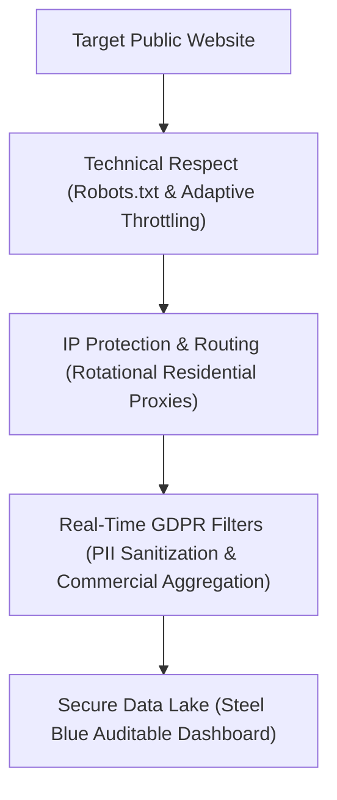

# 👑 Ethical Web Scraping & GDPR: How Enterprises Extract Public Web Data with Absolute Legal & Technical Security

**By Vasile Bratu**  
*Senior Python Engineer & Compliant Data Architect*

---

Data is the ultimate fuel of the global digital economy. In 2026, an enterprise's capability to gather, refine, and leverage web data is its single most powerful competitive differentiator. Whether monitoring global e-commerce pricing, aggregating real-time real estate leads, or harvesting massive open-source corpora for machine learning training, **web scraping (automated data extraction)** is the core technology powering commercial success.

Yet, in corporate boardrooms and corporate legal offices across Europe and the USA, an overwhelming anxiety persists: *Is web scraping legal? How does it align with the GDPR, CCPA, and cybersecurity regulations?*

This concern is well-founded. The market is saturated with amateur scraping scripts that overload target web servers, violate access directories, or harvest personal details indiscriminately. However, when executed under rigorous software engineering guidelines, **web scraping is completely legal, highly ethical, and a global industry standard.**

This article demonstrates how enterprises can build resilient, compliant **automated data pipelines** that adhere to global data privacy laws while driving significant business revenue.

---

## 🎯 1. The Hook: Public Market Intelligence vs. Private Data Theft

To navigate the legal landscape of data collection, we must establish a core legal boundary: **accessing data hidden behind authentication walls (private profiles, banking details, secure portals) is heavily restricted, whereas extracting public web data exposed openly to the internet is completely legal and intended for indexing.**

Consider these two contrasting operational structures:
*   **Structure A (Illegal & Unethical):** An automated bot brute-forces credentials to enter a competitor's private user portal, or harvests non-public personal email directories to build spam lists. This is a clear breach of computer fraud and data privacy laws.
*   **Structure B (Completely Legal & Ethical):** A custom indexing pipeline scans public e-commerce store directories to aggregate prices exposed openly to all shoppers, or collects public business details posted by sellers with the explicit purpose of receiving commercial inquiries. This is legitimate market research, technically equivalent to a manual researcher recording retail shelf prices with a notepad.

**Professional enterprise web crawling operates exclusively within the bounds of Structure B, securing critical market intelligence without legal risk.**

---

## 🛑 2. The Bottleneck: The Three Critical Mistakes of Unprofessional Scrapers

Most enterprise data extraction initiatives run into legal or technical barriers due to elementary architectural errors:
1.  **Technical Aggression (Lack of Rate Limiting):** Basic scripts send hundreds of concurrent requests per second to a target server. This mimics a Denial-of-Service (DoS) attack, degrading host performance and triggering security firewalls.
2.  **Disregarding Access Directories (Robots.txt):** The `robots.txt` file is the industry-standard protocol websites use to communicate which paths are indexable and which are off-limits. Neglecting these rules signals technical disrespect.
3.  **Indiscriminate Harvesting of Personal Information (PII):** Extracting real names, personal emails, or private residential addresses without an explicit, valid legal basis (such as *legitimate interest* as defined under Article 6 of the GDPR) constitutes a direct violation of data privacy frameworks.

---

## ⚡ 3. The Architecture: Building Ethical & Resilient Data Ingestion Pipelines

To guarantee absolute compliance and technical safety for our enterprise partners, we design data harvesting engines around three fundamental engineering principles:

1.  **Polite Crawling & Adaptive Rate Limiting:** We implement randomized request spacing and exponential backoff loops. If a target host displays elevated latency or server load, our scraping agents dynamically slow down, replicating standard human browsing behavior.
2.  **Access Protocol Compliance:** Our systems programmatically audit target `robots.txt` paths before initialization, ensuring our crawlers bypass administrative directories and restricted pages.
3.  **Real-Time PII Sanitization (GDPR Filtering):** We engineer real-time sanitization filters inside our Python data pipelines. If a public listing accidentally contains highly sensitive personal information, our algorithms wipe the PII in memory before writing to disk, ensuring your database stows only clean, non-sensitive commercial fields (prices, stock, public hyperlinks).

---

## 📊 4. The "Steel Blue" Reporting Standard: Auditability & Corporate Design

C-level decision-makers require flawless data integrity and presentation. For corporate compliance reporting and data delivery, we deploy the custom **"Steel Blue"** design standard:

*   **Corporate Steel Blue Palette**: Cool, professional tones of steel blue, soft gray, and navy accents that instantly communicate structured order, technical security, and compliance.
*   **Fully Auditable Data Records**: Every dataset includes a source verification column (`Source URL`) and an extraction timestamp (`Scraped Timestamp`), providing corporate legal counsel with a fully transparent audit trail.
*   **Spacious Administrative Grid**: With row heights configured at 22-25pt, utilizing clean, professional typography (such as **Segoe UI** or **Outfit**) for effortless review on tablets, laptops, or mobile devices during executive travel.
*   **Clean Hyperlink Integration**: Active Excel formulas: `=HYPERLINK(url, "Verify Source ↗")` eliminate long, unappealing URLs, facilitating rapid data verification.

---

## 🛡️ 5. The Legal Precedent: Web Scraping in European & US Jurisprudence

Global courts have consistently upheld the legality of ethical web scraping. Landmark legal cases (such as the historic *hiQ Labs v. LinkedIn* ruling in the US) have cemented the principle that **publicly available data on the internet cannot be locked or monopolized by the platform hosting it.** 

So long as automated extraction is executed politely (without impacting target server operations) and filters out sensitive, non-public personal information in accordance with GDPR and CCPA guidelines, enterprises are fully legally empowered to utilize web crawling to accelerate operational efficiency and market intelligence.

---

## 🚀 The Roadmap: Compliant, High-Quality Web Data for Your Enterprise

Information is the ultimate business leverage, but only when collected with absolute technical and legal integrity. Avoid exposing your brand to regulatory fines or technical IP bans through crude, amateur scripts. Invest in high-performance, compliant data pipelines that protect your brand's reputation.

If you are ready to implement a secure, automated public data flow in your organization:

> [!TIP]
> **Initialize your ethical data pipeline today:**
> I am ready to conduct a **free technical compliance and web crawling audit** for your enterprise. I will analyze your target portals, design a polite extraction strategy, and deliver a **50-record clean sample dataset** styled in our premium **"Steel Blue"** executive format—with zero cost or obligation.

**Send me a quick message on WhatsApp or email to launch your free data pilot!**
*   **Direct Message on WhatsApp:** [+39 320 948 1876](https://wa.me/393209481876)
*   **Professional Email:** [amendamax@vasiledev.com](mailto:amendamax@vasiledev.com)
*   **Open-Source Portfolio (GitHub):** [github.com/amendamax/python-b2b-lead-scrapers](https://github.com/amendamax/python-b2b-lead-scrapers)

---
*Developed by Vasile Bratu © 2026. High-Performance Software Engineering & Data Architecture.*
