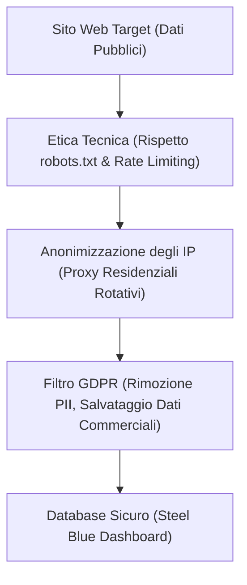

# 👑 Web Scraping Etico e GDPR: Come le aziende possono raccogliere dati pubblici online in totale sicurezza legale e tecnica

**Di Vasile Bratu**  
*Senior Python Engineer & Compliant Data Architect*

---

I dati sono il nuovo petrolio dell'economia globale. Nel 2026, la capacità di un'azienda di raccogliere, analizzare e valorizzare le informazioni presenti su internet costituisce il suo principale vantaggio competitivo. Che si tratti del monitoraggio dei prezzi e-commerce, della raccolta di lead immobiliari o dell'acquisizione di dati di mercato per addestrare sistemi di intelligenza artificiale, il **web scraping (la raccolta automatizzata dei dati)** è la tecnologia chiave per il successo commerciale.

Tuttavia, all'interno dei consigli di amministrazione e dei dipartimenti legali di molte aziende italiane aleggia un forte timore: *Il web scraping è legale? Come si concilia con il GDPR (Regolamento Generale sulla Protezione dei Dati) e con la sicurezza informatica?*

Questo timore è giustificato dalla diffusione di script improvvisati e non professionali che sovraccaricano i server web altrui o raccolgono dati personali in modo invasivo. Tuttavia, quando eseguito secondo rigorosi standard ingegneristici, **il web scraping è completamente legale, etico e rappresenta una prassi standard a livello globale.**

Questo articolo dimostra come le aziende possano implementare flussi di dati automatizzati (Data Pipelines) etici, nel pieno rispetto del GDPR e delle migliori pratiche tecniche per accelerare la crescita aziendale senza alcun rischio legale.

---

## 🎯 1. Il Gancio: La distinzione fondamentale tra furto di dati e ricerche di mercato pubbliche

Per comprendere la liceità del web scraping, occorre operare una distinzione legale fondamentale: **i dati protetti da credenziali di accesso (profili privati, informazioni bancarie, cartelle cliniche) sono tutelati dalle leggi sull'accesso non autorizzato, mentre i dati pubblicamente accessibili su internet sono destinati per loro natura alla consultazione pubblica e all'indicizzazione.**

Esaminiamo due scenari opposti:
*   **Scenario A (Illegale ed Esecrabile):** Uno script forza le credenziali di un portale concorrente, oppure estrae massivamente indirizzi email privati da una sezione riservata di un forum per l'invio di posta indesiderata (SPAM). Questa è una chiara violazione della legge.
*   **Scenario B (Completamente Legale ed Etico):** Un sistema automatico analizza le pagine pubbliche di un negozio online per raccogliere i prezzi esposti a chiunque, oppure estrae i recapiti telefonici da annunci pubblici pubblicati dagli utenti al fine esplicito di ricevere contatti da potenziali acquirenti. Questa è una legittima attività di intelligence commerciale, equivalente a un incaricato che entra fisicamente in un negozio del tutto legalmente per trascrivere i prezzi dei prodotti esposti sugli scaffali.

**Il web scraping professionale opera esclusivamente all'interno dello Scenario B, garantendo al tuo business informazioni strategiche senza esporlo a rischi legali.**

---

## 🛑 2. Il Problema: I tre errori fatali degli scraping non professionali

La maggior parte dei progetti di estrazione dati fallisce o attira provvedimenti a causa di errori tecnici nella fase di sviluppo:
1.  **Aggressività Tecnica (Assenza di Rate Limiting):** Script rudimentali effettuano centinaia di richieste al secondo verso lo stesso server. Questo comportamento imita un attacco informatico di tipo DoS (Denial of Service) e rischia di rallentare o mandare in crash la piattaforma monitorata.
2.  **Ignorare le Direttive di Accesso (Robots.txt):** Il file `robots.txt` è lo standard con cui un sito indica agli spider quali sezioni possono essere analizzate e quali devono essere evitate. Gli script non conformi ignorano sistematicamente questo protocollo.
3.  **Raccolta Indiscriminata di Dati Personali (PII):** Estrarre in blocco nomi, email personali o indirizzi fisici senza una base giuridica idonea (come il *legittimo interesse*, definito dall'Articolo 6 del GDPR) configura una violazione diretta della normativa europea.

---

## ⚡ 3. La Soluzione: I pilastri di un sistema di Web Scraping Etico e Compliant

Per garantire la massima sicurezza tecnica e legale ai nostri clienti, progettiamo condotte di dati basate su tre regole auree:

1.  **Rate Limiting e Cortesia Tecnica (Polite Scraping):** Implementiamo ritardi casuali tra le richieste (randomized delays) e algoritmi di exponential backoff. Se il server monitorato mostra segnali di rallentamento, il crawler riduce automaticamente la propria frequenza di scansione, replicando il comportamento di un utente reale.
2.  **Rispetto del file robots.txt e dei Termini di Servizio:** I nostri crawler verificano preventivamente le regole di accesso del sito web, evitando rigorosamente le sezioni sensibili o escluse dagli amministratori.
3.  **Filtrazione GDPR Real-Time**: I nostri script integrano moduli dedicati all'identificazione e alla rimozione automatica dei dati personali identificabili (PII). Qualora in un annuncio pubblico venisse rilevato per errore un dato sensibile (es. un codice fiscale o un indirizzo residenziale privato), l'algoritmo in Python lo elimina all'istante prima del salvataggio nel database, registrando unicamente le informazioni commerciali di interesse (prezzi, scorte, link pubblici).

---

## 📊 4. Lo Standard di Design "Steel Blue": Trasparenza ed Integrità Visiva

Le decisioni direzionali necessitano di una presentazione impeccabile dei dati. Per i report di conformità e per i dataset finali consegnati alle aziende, abbiamo elaborato lo standard visivo **"Steel Blue"**:

*   **Paletta Cromatico Professional Blue**: Sfumature eleganti di blu acciaio, grigio chiaro e blu cobalto. Colori freddi e rigorosi che trasmettono immediatamente sicurezza, conformità normativa ed ordine strutturale.
*   **Architettura Tracciabile ed Auditabile**: I report includono sempre le colonne relative all'URL di origine (`Source URL`) e alla marca temporale dell'estrazione (`Scraped Timestamp`), offrendo al tuo team legale una tracciabilità al 100% per eventuali audit interni.
*   **Leggibilità Premium**: Spaziatura ampia, altezza righe fissata a 22-25pt e utilizzo del font aziendale **Segoe UI** o **Outfit**, ideale per presentazioni nei consigli di amministrazione.
*   **Collegamenti Funzionali Attivi**: Formule Excel native `=HYPERLINK(url, "Vedi Fonte ↗")` per consentire di verificare istantaneamente la fonte originaria di ogni singola riga di dati.

---

## 🛡️ 5. Il Quadro Legale: Lo Scraping nella Giurisprudenza Europea

A livello europeo ed internazionale, le corti di giustizia hanno ripetutamente sancito la legittimità dello scraping etico. Sentenze storiche (come la celebre decisione *hiQ Labs vs. LinkedIn*) hanno stabilito che **i dati pubblici su internet non possono essere monopolizzati o blindati dalle piattaforme che li ospitano.** 

A patto che l'estrazione non pregiudichi le prestazioni del sito web monitorato e non tratti dati sensibili personali in violazione dei diritti degli interessati, le imprese sono libere di avvalersi di queste tecnologie per ottimizzare i propri processi produttivi e di vendita.

---

## 🚀 Conclusione: Dati di qualità superiore, senza ombre legali

L'informazione è potere, ma solo se raccolta in modo etico, regolare e corretto. Non esporre la tua azienda a sanzioni o a blocchi infrastrutturali affidandoti a script rudimentali o non conformi. Scegli pipeline professionali che rispettano la legge e tutelano la reputazione del tuo brand.

Se desideri integrare un flusso automatizzato di dati pubblici nella tua azienda in totale sicurezza:

> [!TIP]
> **Avvia un monitoraggio sicuro ed etico oggi stesso:**
> Sono pronto a offrirti una **consulenza tecnica e legale gratuita sulla conformità dei dati della tua azienda**. Analizzerò i siti web che intendi monitorare, ti proporrò una strategia di scraping etico e ti fornirò un **campione gratuito di 50 record puliti**, formattati secondo i nostri standard **"Steel Blue"**, per farti toccare con mano la qualità del dato etico—senza alcun costo o vincolo da parte tua.

**Inviami un messaggio rapido su WhatsApp o e-mail per richiedere la tua consulenza gratuita!**
*   **Messaggio diretto WhatsApp:** [+39 320 948 1876](https://wa.me/393209481876)
*   **E-mail:** [amendamax@vasiledev.com](mailto:amendamax@vasiledev.com)
*   **Portfolio Codice Sorgente (GitHub):** [github.com/amendamax/python-b2b-lead-scrapers](https://github.com/amendamax/python-b2b-lead-scrapers)

---
*Developed by Vasile Bratu © 2026. High-Performance Software Engineering & Data Architecture.*
