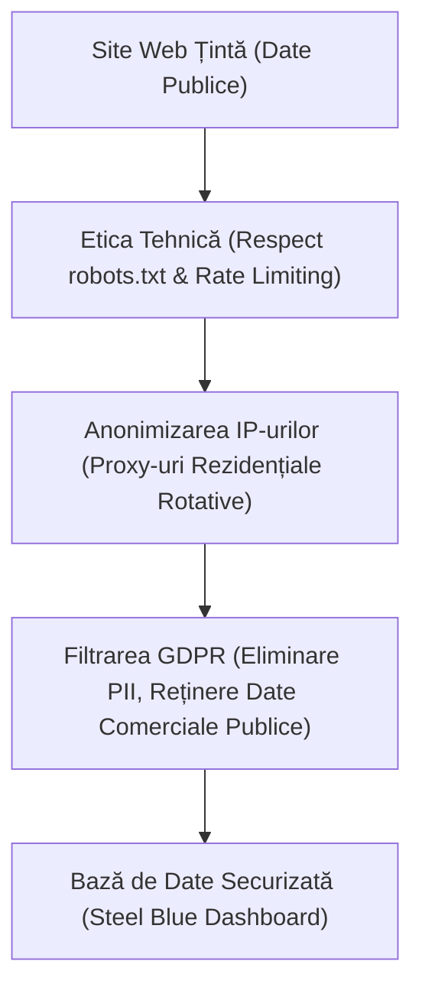

# 👑 Web Scraping Etic și GDPR: Cum companiile pot colecta date publice online în deplină siguranță legală și tehnică

**De Vasile Bratu**  
*Senior Python Engineer & Compliant Data Architect*

---

Datele reprezintă noul petrol al economiei globale. În 2026, capacitatea unei companii de a colecta, analiza și valorifica informațiile de pe internet reprezintă principalul său avantaj competitiv. Fie că este vorba despre monitorizarea prețurilor din e-commerce, agregarea lead-urilor imobiliare sau colectarea de informații de piață pentru inteligența artificială, **web scraping-ul (colectarea automată a datelor)** este tehnologia din spatele succesului comercial.

Cu toate acestea, în consiliile de administrație și în departamentele juridice ale multor companii din România planează o mare temere: *Este web scraping-ul legal? Cum rămâne cu GDPR (Regulamentul General privind Protecția Datelor) și riscurile de securitate cibernetică?*

Această teamă este justificată de existența multor scripturi neprofesioniste care suprasolicită serverele web sau colectează date personale abuziv. Însă, realizat după standarde inginerești riguroase, **web scraping-ul este complet legal, etic și reprezintă o practică standard la nivel global.**

Acest articol demonstrează cum pot companiile să implementeze conducte automate de date (Data Pipelines) etice, respectând cu strictețe legislația GDPR și bunele practici tehnice pentru a crește vânzările fără niciun risc juridic.

---

## 🎯 1. Cârligul: Diferența critică dintre furtul de date și inteligența de piață publică

Pentru a înțelege legalitatea colectării datelor, trebuie să facem o distincție juridică fundamentală: **datele din spatele unui ecran de autentificare (cont privat, date bancare, istoric medical) sunt protejate prin legi stricte privind accesul neautorizat, în timp ce datele expuse public pe internet sunt destinate indexării și consultării publice.**

Imaginează-ți următoarele scenarii:
*   **Scenariul A (Ilegal & Neetic):** Un script sparge baza de date a unui competitor sau colectează liste de e-mailuri private din secțiuni securizate ale unui forum pentru a le trimite mesaje nesolicitate (SPAM). Aceasta este o încălcare clară a legii.
*   **Scenariul B (Complet Legal & Etic):** Un sistem automatizat scanează paginile publice ale unui magazin online pentru a colecta prețurile expuse deschis tuturor cumpărătorilor, sau extrage numerele de telefon din anunțuri publice publicate de utilizatori cu scopul explicit de a fi contactați de potențiali clienți. Aceasta este o cercetare legitimă de piață, echivalentă cu un angajat care merge fizic în magazin cu o agendă pentru a nota prețurile de la raft.

**Web scraping-ul profesionist colectează exclusiv date din Scenariul B, oferind business-ului tău informații vitale fără riscuri legale.**

---

## 🛑 2. Problema: Cele trei mari greșeli ale scrapere-lor neprofesioniste

Multe proiecte de colectare a datelor eșuează sau atrag sancțiuni din cauza unor erori tehnice de implementare:
1.  **Agresivitatea Tehnică (Lipsa de Rate Limiting):** Scripturile rudimentare fac sute de cereri pe secundă către un site web. Acest comportament seamănă cu un atac cibernetic de tip DoS (Denial of Service) și poate încetini sau bloca site-ul țintă.
2.  **Ignorarea Directivelor de Acces (Robots.txt):** Fișierul `robots.txt` este protocolul prin care un site web comunică ce secțiuni dorește să fie scanate și ce secțiuni dorește să fie ocolite. Scripturile neconforme ignoră complet aceste recomandări.
3.  **Colectarea nediferențiată de Date Personale (PII):** Extragerea în masă a numelor, adreselor de e-mail personale sau a profilurilor private fără un temei juridic valid (cum ar fi interesul legitim, definit de Articolul 6 din GDPR) constituie o încălcare directă a Regulamentului.

---

## ⚡ 3. Soluția: Pilonii unui sistem de Web Scraping Etic și Compliant

Pentru a garanta siguranța absolută a datelor colectate pentru clienții noștri, proiectăm conducte de date bazate pe trei reguli tehnice de aur:

1.  **Rate Limiting și Politețe Tehnică (Polite Scraping):** Implementăm întârzieri dinamice între cereri (randomized delays) și algoritmul exponential backoff. Dacă serverul țintă arată semne de încărcare crescută, crawler-ul nostru își reduce automat viteza, comportându-se exact ca un vizitator uman care navighează pagină cu pagină.
2.  **Respectarea robots.txt și a termenilor de utilizare:** Proiectăm sisteme inteligente care verifică regulile site-ului înainte de scanare, asigurându-ne că nu accesăm pagini sensibile sau restricționate de administratorii platformei.
3.  **Filtrarea GDPR în Timp Real:** Scripturile noastre conțin module speciale de filtrare a datelor personale de tip PII (Personally Identifiable Information). Dacă în anunțul scanat apare o adresă personală de acasă sau un CNP introdus din greșeală de utilizator, algoritmul Python le elimină instantaneu înainte ca datele să fie salvate în baza ta de date, stocând exclusiv datele comerciale de interes (prețuri, stocuri, link-uri publice).

---

## 📊 4. Standardul de Design "Steel Blue": Securitate și Integritate Vizuală

Deciziile corporative de nivel înalt au nevoie de o prezentare impecabilă a datelor. Pentru rapoartele de conformitate și livrabilele de date, am creat standardul vizual **"Steel Blue"**:

*   **Paletă Cromatică Professional Blue**: Combinații elegante de albastru oțel, gri deschis și albastru cobalt, culori reci care transmit instantaneu siguranță, profesionalism, ordine și conformitate tehnică.
*   **Structură Auditabilă**: Rapoartele includ o coloană specială pentru sursa originală a datelor (`Source URL`) și marca temporală a colectării (`Scraped Timestamp`), oferind echipei tale juridice un istoric de audit 100% transparent.
*   **Citibilitate Maximă**: Margini aerate, înălțimi de rând de 22-25pt și utilizarea fontului corporativ **Segoe UI** sau **Outfit**, perfect pentru a fi prezentat în ședințele de board.
*   **Active Formulas & Export**: Formule de hyperlink elegante `=HYPERLINK(url, "Vezi Sursa ↗")` care înlocuiesc URL-urile lungi și inestetice, permițând auditul rapid al oricărei linii de date.

---

## 🛡️ 5. Cadrul Legal: Scraping-ul în Jurisprudența Europeană

La nivel internațional și european, instanțele de judecată au confirmat în mod repetat legalitatea scraping-ului etic. Cazuri de referință (cum ar fi decizia istorică *hiQ Labs vs. LinkedIn*) au stabilit că **datele publice de pe internet nu pot fi monopolizate de platformele care le găzduiesc.** 

Atâta timp cât colectarea nu afectează negativ performanța site-ului țintă și nu colectează/utilizează date cu caracter personal în scopuri abuzive sau contrare interesului legitim, companiile sunt libere să folosească aceste tehnologii pentru a-și crește eficiența.

---

## 🚀 Concluzie: Date de înaltă calitate, fără riscuri legale pentru compania ta

Informația înseamnă putere, dar numai atunci când este colectată corect și etic. Nu îți expune afacerea la amenzi sau blocaje tehnice apelând la scripturi ieftine sau neconforme. Investește în conducte profesionale de date care respectă legislația și îți protejează reputația.

Dacă vrei să integrezi un flux automat de date publice în compania ta în deplină siguranță:

> [!TIP]
> **Începe o colectare sigură și etică chiar de astăzi:**
> Sunt pregătit să configurez o **consultanță gratuită de conformitate tehnică și legală a datelor**. Voi analiza site-urile pe care dorești să le monitorizezi, îți voi propune o strategie de scraping etic și îți voi livra o **mostră de 50 de înregistrări curate**, formatate premium în stilul **"Steel Blue"**, ca să vezi exact cum arată datele colectate etic, fără niciun cost sau obligație.

**Trimite-mi un mesaj rapid pe WhatsApp sau e-mail pentru a stabili consultanța ta gratuită!**
*   **Mesaj direct pe WhatsApp:** [+39 320 948 1876](https://wa.me/393209481876)
*   **E-mail:** [amendamax@vasiledev.com](mailto:amendamax@vasiledev.com)
*   **Portofoliu Cod Sursă (GitHub):** [github.com/amendamax/python-b2b-lead-scrapers](https://github.com/amendamax/python-b2b-lead-scrapers)

---
*Developed by Vasile Bratu © 2026. High-Performance Software Engineering & Data Architecture.*
