# Technical Proposal: Home-Buying Journey Orchestrator MVP
**Prepared for:** Viktorija Rudanova
**Prepared by:** Vasile Bratu (Senior Python & Data Automation Engineer)

---

## 🚀 1. Tech Stack & Backend Recommendations

To build a secure, scalable, and modular backend that integrates seamlessly with your frontend POC, I recommend the following stack:

*   **Language:** **Python 3.11+** (Fast development cycle, native ecosystem for AI integration, OCR, and data handling).
*   **Web Framework:** **FastAPI** 
    *   *Why:* Extremely fast (on par with Node.js/Go), built-in OpenAPI docs, native asynchronous support, and clean Pydantic integration for data validation.
*   **Database:** **PostgreSQL**
    *   *Why:* Robust relational database, ideal for handling complex relationships (users, tasks, invited professionals) and highly secure.
*   **Object Storage:** **AWS S3** (with Server-Side Encryption) for the secure document vault.
*   **AI Integration:** **Gemini API** or **OpenAI API** (using structured Pydantic outputs to enforce safety and prevent unregulated financial advice).

---

## 🗄️ 2. Core Database Objects (Day One Schema)

To support secure user ingestion, milestone tracking, document storage, and professional collaboration, the database will require these core tables:

1.  **`users`**: Core credentials, authentication (hashed password), and account state.
2.  **`user_profiles`**: Secure, encrypted storage of personal data (names, current financial state, target budget, target purchase date).
3.  **`invited_professionals`**: Manages the collaboration between home buyers and invited experts (solicitors, mortgage brokers, agents).
    *   *Fields:* `id`, `buyer_id` (FK), `email`, `role` (e.g., SOLICITOR, BROKER), `status` (PENDING, ACTIVE), `invite_token`, `created_at`.
4.  **`roadmap_milestones` & `user_tasks`**: Defines the steps of the home-buying checklist and tracks individual completion states.
5.  **`document_vault`**: File metadata for uploaded PDFs. File contents are stored securely in S3.
    *   *Fields:* `id`, `user_id` (FK), `file_name`, `s3_key`, `document_type` (e.g., ID, BANK_STATEMENT), `status` (UPLOADED, PARSED).
6.  **`stock_assets`**: Tracks user investment shares used to raise deposits.
    *   *Fields:* `id`, `user_id` (FK), `ticker` (e.g., AAPL), `quantity`, `average_buy_price`, `updated_at`.
7.  **`ai_chat_sessions`**: Stores chat history between users and the AI helper, allowing the AI to maintain context over time.

---

## ⏳ 3. 8-12 Weeks Clickable/Product MVP Roadmap

### 🏁 What We Build (MVP Scope)

```mermaid
gantt
    title MVP Development Timeline (8-12 Weeks)
    dateFormat  X
    axisFormat %d
    section Phase 1: Core API
    Secure Auth & DB Setup    :active, p1, 0, 4
    section Phase 2: Features
    Roadmap & S3 Vault        :active, p2, 4, 8
    Invites & Stock Tracker   :p3, 8, 10
    section Phase 3: AI & Integration
    Context-Aware AI Assistant :p4, 10, 12
```

*   **Weeks 1–4: Core Foundation & Auth (Security First)**
    *   Set up PostgreSQL database and SQLAlchemy models.
    *   Implement secure signup/login using OAuth2 with JWT (JSON Web Tokens).
    *   Build Profile endpoints for secure personal data input.
*   **Weeks 5–8: Milestone Roadmap & S3 Document Vault**
    *   Build checklist engine (milestones, tasks, and state persistence).
    *   Integrate AWS S3 for secure document upload and retrieval using temporary pre-signed URLs.
    *   Build "Readiness Indicators" engine (purely mathematical, non-regulated formulas comparing current savings + assets vs. target budget).
*   **Weeks 9–10: Professional Collaboration & Stock Tracker**
    *   Build invitation pipeline (buyer invites a professional -> professional receives a link to log in and view shared checklist statuses).
    *   Build a simple Stock portfolio engine using a public finance API (e.g., Yahoo Finance) to update the current value of user-held shares in their dashboard.
*   **Weeks 11–12: Context-Aware AI Assistant & Integration**
    *   Integrate LLM API (Gemini/OpenAI) using strict system instructions to guarantee the AI stays within "readiness guidance" bounds and **never** gives regulated mortgage/financial/legal advice.
    *   Deploy the API to a staging environment (e.g., DigitalOcean) for full integration with your frontend POC.

### 🚫 What We Leave Out of the MVP

*   **Real Open Banking API Integrations:** (e.g., Plaid/Yapily) - Instead, we use manual data entry and Mock API feeds to simulate data flow without high compliance hurdles.
*   **Full Auto-OCR document verification:** - Users upload documents for the broker/solicitor to review manually; automated parsing is pushed to V2.
*   **Automatic matching with local professionals:** - Kept simple via email-based invitations.
*   **Real-time trading execution:** - Stocks are only tracked by current price, no buying/selling within the app.

---

## 📐 4. Reusable Backend Platforms ("Horizontal Builds")

In software engineering, a **horizontal build** means constructing a foundational, decoupled platform layer (API services, auth, notifications, AI wrappers, file vault) that remains independent of specific frontend layouts.
*   By building the backend as a clean, documented RESTful API (using FastAPI), we ensure that this same backend can serve a web app, a mobile app (iOS/Android), or a future widget without changing a single line of database code.
*   I have built multiple horizontal backends in Python that manage data synchronization, user profiles, and API gateways, ensuring that features are highly modular and easy to scale.

---

## 💼 5. Portfolio & Open Source Contributions

I invite you to review my work and articles:
*   **GitHub Portfolio:** [github.com/amendamax](https://github.com/amendamax) (Featuring automated scraping suites, data synchronizers, and Python automation tools).
*   **How I Build Clean Excel Reports Programmatically:** [Read my Dev.to Article](https://dev.to/amendamax2025/how-to-build-executive-ready-excel-reports-directly-in-python-using-openpyxl-393c)
*   **Ethical Web Scraping & GDPR Compliance:** [Read my Dev.to Article](https://dev.to/amendamax2025/ethical-web-scraping-gdpr-how-enterprises-extract-public-web-data-with-absolute-legal--1fb9)
